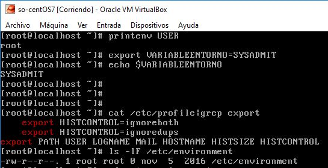

### Taller 1
**Universidad ICESI**  
**Curso:** Sistemas Operativos  
**Docente:** Daniel Barragán C.  
**Estudiante:** Jorge Eliecer Castaño Valencia.  
**Tema:** Comandos de Linux, Estructura de directorio, Virtualización  
**Correo:** daniel.barragan at correo.icesi.edu.co

### Objetivos
* Conocer y emplear comandos de Linux para la realización de tareas administrativas

### Prerrequisitos
* Virtualbox o WMWare
* Máquina virtual con sistema operativo CentOS7

### Descripción
El primer taller del curso sistemas operativos trata sobre el sistema operativo Linux, la estructura de sus directorios y virtualización 

### Actividades

1. Explique la función de los directorios en la raíz de sistema operativo Linux-CentOS.
Proporcione ejemplos de los archivos que se encuentran en cada directorio (explique al menos un
archivo por directorio).

**Directorios**  
Toda la información, ya sean textos, imágenes, o información para la configuración del sistema, se almacena en "ficheros", que a su vez se guardan en "directorios". Un directorio es un conjunto de archivos, que a su vez pueden contener otros directorios, agrupados de una manera estructurada y poseen permisos los cuales restringen las acciones o actividades de los usuarios. El árbol de directorios nos ayuda a saber dónde se encuentra un archivo.

Todos los ficheros y directorios de un sistema UNIX cuelgan de un directorio principal llamado "raíz", que se representa como "/". El directorio raíz es la base para todo el arbol de directorios, es allí donde están contenidos todos lo directorios del sistema.

| Directorio   | Archivo ejemplo | Descripción del contenido del directorio  |
|------|------|------|
| bin  | kill | Almacena la mayoría de los programas esenciales del sistema. |
| boot | boot.b | Ficheros de configuración del arranque, núcleos y otros ficheros necesarios para el arranque (boot) del equipo. |
| dev | snd | Contiene archivos especiales del sistema, conocidos como controladores de dispositivo (device drivers), los cuales se usan para acceder a los dispositivos del sistema y recursos, como discos duros, modems, memoria, etc. |
| etc | services | Ficheros de configuración y arranque del sistema Linux. |
| home | musica, imagenes, etc | directorios personales (home) para los diferentes usuarios. |
| lib | libcap.so.1 | Librerías del sistema (libraries). |
| mnt | archivos cdrom | Sistemas de archivos montados manualmente en el disco duro. !
| opt | Archivos y Programas  | Proporciona una ubicación donde instalar aplicaciones opcionales (de terceros). |
| proc |  Información del sistema  | Directorio dinámico especial que mantiene información sobre el estado del sistema, incluyendo los procesos actualmente en ejecución |
| root | Archivos personales | Directorio personal del usuario root (superusuario); también llamado "barra-root". |
| sbin | reboot | Binarios importantes del sistema, que son únicamente accesibles al administrador. |
| srv | Archivo de un servidor FTP | Puede contener archivos que se sirven a otros sistemas. |
| sys | Variables del kernel | Archivos del sistema (system) |
| tmp | Archivos temporales | Archivos temporales del sistema. |
| usr |  Archivos de configuración, ejecutables, fuentes, etc | Aplicaciones y archivos a los que puede acceder la mayoría de los usuarios. |
| var | Variables y los logs | Archivos variables como archivos de registros y bases de datos. |

2. En una tabla como se muestra a continuación escriba 10 comandos de Linux no visto en clase. Puede incluir comandos que funcionan una vez han sido instalados con yum

| Comando   | Usuario | Descripción   |
|------|------|------|
| free | user | Estadisticas de uso de Memoria. |
| ping -s 1016 | user | Manda paquetes de ping de 1024 bytes (header 8 bytes), mientras que el “default” es 512. |
| ps -aux | user | Despliega todos los procesos del sistema, con nombre y tiempo de inicio. |
| ulimit | root | Muestra los limites del sistema (maximo de ficheros abiertos, etc..) |
| iptraf | root | Muestra en una aplicacion de consola TODO el trafico de red IP, UDP, ICMP. Permite utilizar filtros, y es SUMAMENTE UTIL para diagnostico y depuracion de firewalls. |
| sniffit | root | Sniffer o husmeador de todo el trafico de red. No suele venir instalado por defecto. |
| find nombre-de-archivo | user | Busca un archivo. |
| whereis nombre-de-programa | user | Muestra dónde puede estar un programa. |
| top | root | Muestra todos los procesos en funcionamiento. |
| kill pid | root | Mata un proceso con un PID concreto. Verás el PID de un proceso con top. |

3. ¿Cuál es la utilidad del comando printenv en Linux?, Investigue acerca de la creación de variables de ambiente en Linux y como hacerlas permanentes. Cree una variable de ambiente, hágala permanente y muestre evidencias del funcionamiento.

**printenv**  
Imprime los valores de la o las variables del entorno especificada, si la variable especificada no esta, impirme el par de nombre y valor de todos ellos.

**Sintaxis:**  
printenv [OPTION]... [VARIABLE]...

Para crear una variable de entorno, se utiliza el comando export.  
Por ejemplo:  
[root@localhost ~]# printenv USER
root  
[root@localhost ~]# export VARIABLEENTORNO=SYSADMIT  
[root@localhost ~]# printenv | grep VARIABLEENTORNO  
VARIABLEENTORNO=SYSADMIT  
[root@localhost ~]# echo $VARIABLEENTORNO  
SYSADMIT

**¿Cómo configuramos una variable de entorno permanente?**  
Tendremos que configurar el **export** que establece la variable de entorno al inicio, editando alguno de los scripts de inicio que se ejecutan de forma predeterminada.

Para ello, disponemos de los siguientes scripts que se cargan al inicio:

* Para todos los usuarios:  
/etc/profile

* Para un usuario específico:  
~/.bash_profiles
~/.bash_login
~/.profile

El orden de carga de los scripts de inicio es el indicado, es decir primero se ejecuta: **/etc/profile** y luego al hacer login, por este orden:  
~/.bash_profile, ~/.bash_login, ~/.profile  

~/ : Se refiere al home directory del usuario, por ejemplo, para el usuario root:  ~/ equivale a /root/

**NOTA:** También podemos ver como los scripts de usuario, tienen un punto al principio del nombre del fichero, por lo tanto son ficheros ocultos.

Podemos ver las variables de entorno permanentes que se inicializan en **/etc/profile**, ejecutando:
cat /etc/profile|grep export

* Si encontramos el fichero: **/etc/environment** en nuestro sistema operativo Linux, será el sitio donde ubicar las variables de entorno permanentes. Tengamos en cuenta que las reglas aquí configuradas se ejecutarán para todos los usuarios.

Ejemplo:  
[root@localhost ~]# ls -lF /etc/environment  
-rw-r--r--. 1 root root 0 Oct 29  2014 /etc/environment

En este ejemplo, podemos ver como existe el fichero **/etc/environment** y ocupa 0 bytes, pero al existir, significa que el sistema lo procesará al inicio, por lo tanto si lo editamos y situamos las variables de entorno allí, serán procesadas.

Esta es la forma más limpia de configurar nuestras variables de entorno permanentes a nivel de equipo, ya que la definición de las mismas quedará separada del resto de configuración definida en los scripts de inicio.

**El formato del interior de /etc/environment para definir las variables de entorno permanentes es el siguiente:**
VARIABLEENTORNO=SYSADMIT

### Nota

El informe debe ser entregado en formato README.md y debe ser subido a un repositorio de github. El repositorio de github debe ser un fork de https://github.com/ICESI-Training/so-workshop1 y para la entrega deberá hacer un Pull Request (PR) respetando la estructura definida. El código fuente y la url de github deben incluirse en el informe.  

## Referencias

* https://github.com/ICESI/so-commands/tree/master/centos7
* https://cmdchallenge.com  
* https://www.gutenberg.org
* http://www.rinconsolidario.org/linux/cursoLinux/comoUsarLinux/directorios/directorios.html
* https://computernewage.com/2015/06/14/el-arbol-de-directorios-de-linux-al-detalle-que-contiene-cada-carpeta/
* https://help.ubuntu.com/kubuntu/desktopguide/es/directories-file-systems.html
* http://docencia.udea.edu.co/cci/linux/dia4/directorio.htm
* https://www.computerhope.com/unix/printenv.htm
* http://www.sysadmit.com/2016/04/linux-variables-de-entorno-permanentes.html
